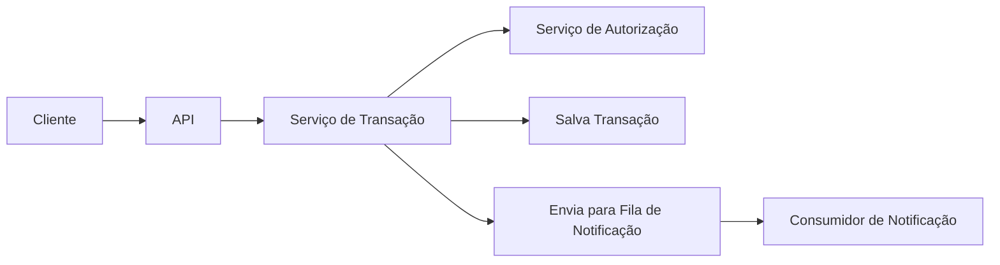

# picpay-desafio

[](https://www.java.com/)
[](https://spring.io/projects/spring-boot)
[](https://maven.apache.org/)
[](https://www.postgresql.org/)

API de transações inspirada no PicPay, desenvolvida em Java com Spring Boot. O projeto simula transferências entre carteiras digitais, incluindo validação, autorização externa, persistência e notificação de transações.

---

## Menu

- [Visão Geral](#visão-geral)
- [Fluxo da Aplicação](#fluxo-da-aplicação)
- [Variáveis de Ambiente](#variáveis-de-ambiente)
- [Como Contribuir](#como-contribuir)

---

## Visão Geral

Esta API permite que clientes realizem transferências entre carteiras digitais. O fluxo contempla validação de regras de negócio, autorização via serviço externo, registro da transação em banco de dados e envio de notificações para os usuários envolvidos.

---

## Fluxo da Aplicação



1. **Cliente** faz uma requisição para a **API**.
2. A **API** aciona o **Serviço de Transação**, que valida a operação.
3. O serviço consulta o **Serviço de Autorização** externo.
4. Se autorizado, a transação é salva no banco de dados.
5. Uma notificação é enviada para uma fila.
6. O **Consumidor de Notificação** processa e envia a notificação ao usuário.

---

## Variáveis de Ambiente

Configure a URL do serviço de autorização externo:

```
ENV_CONSULTA_AUTORIZACAO_URL=https://util.devi.tools
```

---

## Como Contribuir

Contribuições são bem-vindas! Sinta-se à vontade para abrir issues, sugerir melhorias ou enviar pull requests. Consulte as boas práticas e o código de conduta do projeto.

---

> Projeto educacional para fins de estudo e demonstração de arquitetura de microsserviços com Java e Spring Boot.
